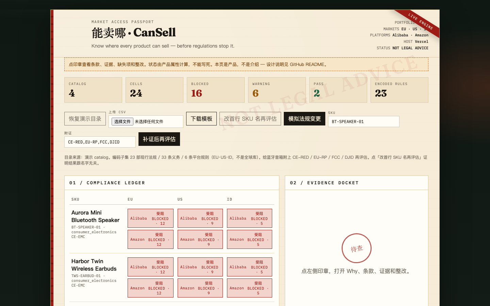

# CanSell · 能卖哪

**Global Product Compliance**

<p align="center">
  
</p>

**Know where every SKU can sell, why, and what to fix.**

Product-centric compliance intelligence for Chinese exporters.

上传商品目录，判断每个 SKU 在不同国家和平台能否销售、为什么、缺什么，以及法规变化后哪些商品受到影响。

> **Existing platforms organize regulations. We organize a company’s products against regulations.**
>
> 现有平台以法规为中心，我们以企业商品为中心。
>
> One product portfolio, every market, every marketplace.

法规情报告诉你「发生了什么」。CanSell 告诉你：**你的哪些商品受到影响，以及下一步做什么。**

Regulatory intelligence tells you what changed. Global Product Compliance tells you which of your products are affected and what to do next.

不是法律意见。不是法规搜索器。不是聊天机器人。也不是欧盟 ESPR 术语 Digital Product Passport。PASS 不是发货许可。

- **产品（Website）：** https://cansell-kappa.vercel.app
- **路演页：** https://cansell-kappa.vercel.app/pitch.html
- **仓库：** https://github.com/WilliamK112/global-product-compliance
- **赛道：** GOAI 2026 无界应用 / Boundless Agents / 赛题五 AI+工业制造

<p align="center">
  <a href="https://cansell-kappa.vercel.app"></a>
</p>

当前演示：4 个广东 SKU × EU / US / ID × Alibaba.com / Amazon。点开印章看 Why、条款和官方 URL。

---

## 00 论旨

中国出口真正缺的不是法条，是「这部法打中我哪几个 SKU」。

今天出口商不是没有法规信息。法规和平台规则非常多，但企业不知道这些规则具体影响自己哪些 SKU。因此核心不是 `LAW → SEARCH`，而是：

```
LAW × PRODUCT × MARKET × PLATFORM → IMPACT → ACTION
```

第一用户：广东中小制造商的外贸/认证岗。付钱的是老板。  
第一垂直：消费电子（蓝牙音箱 + TWS + LED）。化妆品精华液只作对照 SKU，不是第二垂直承诺。  
第一市场：中国产地 → EU / US / 印度尼西亚。  
第一平台：Alibaba.com + Amazon（已编码）。CSV 是通用入口。TikTok Shop / Temu / SHEIN / Shopify 是路线图，不是当前矩阵。Alibaba 是理想第一生态，不是唯一客户。

## Why This Is Different

我们**不是**：

- 法规搜索引擎
- 法律问答 Chatbot
- 单个平台的 Seller Compliance Tool
- 检测认证机构
- 替代律师 / 监管专家的系统

我们做的是面向中国出口企业的 **Product-centric、Cross-market、Cross-platform** 市场准入筛选层：

```
Product Portfolio
      ×
Country
      ×
Marketplace
      ×
Regulation
      ↓
Market Access State
      ↓
Impact
      ↓
Remediation
```

这不是「全球首创」，也不是新品类。RegASK、Enhesa、Amazon 站内合规已经各自解决了很大一块。我们声称的是 **novel combination / whitespace positioning**：把工厂目录、目的国义务、平台叠加、SKU 影响和整改再检查做成一条可验证的执行链。

我们不和 Enhesa、RegASK、IQVIA、Cortellis 拼谁收录得更多。

> We do not aim to out-index Enhesa, RegASK, IQVIA, or Cortellis.
>
> Our differentiation is the operational layer between regulatory intelligence and a merchant’s product portfolio.

中文：我们不和成熟法规数据库竞争谁收录得更多，而是做「法规情报 → 企业商品 → 市场准入动作」的中间执行层。

## 01 引擎必须回答的十问

评审请用这十问压产品，而不是看功能清单。

| # | 问题 | 产品怎么答 |
|---|---|---|
| 01 | 这个 SKU 能不能进入目标国家？ | Market Access State：PASS / WARNING / BLOCKED / UNCERTAIN / EXPERT_REVIEW_REQUIRED。不是 Yes/No。 |
| 02 | 为什么？ | Why 绑定适用条款，不绑定 SKU 名字。 |
| 03 | 缺什么？ | Missing item：证书、标签、责任人、注册号、测试报告。 |
| 04 | 哪些法规适用？ | Regulation Graph 按产品属性匹配。空匹配 = UNCERTAIN，禁止沉默 PASS。 |
| 05 | 哪些平台规则适用？ | Platform Graph 叠在国家法之上。Alibaba.com 与 Amazon 分开评估。 |
| 06 | 风险等级是多少？ | 状态 + confidence + evidence quality + last verified + source authority。 |
| 07 | 需要什么认证 / 文件 / 标签 / 测试？ | Required actions 来自未满足 requirement，不是聊天建议。 |
| 08 | 法规变化后哪些 SKU 受影响？ | Diff → 受影响品类 → 受影响 SKU。不说「出了一部新法」。 |
| 09 | 下一步企业应该做什么？ | Remediation plan + 补证后再评估。 |
| 10 | 哪些结论已验证，哪些要专家复核？ | Verification pyramid。LLM 在最下层，不能单独主张。 |

## 02 今天工厂怎么查「能不能卖去德国」

1. 外贸 / 运营 Google「蓝牙音箱 CE」，微信群和货代 PDF。
2. Alibaba.com / Amazon 上架表单在 SKU 已经存在之后才要证书，平台不回答「GPSR 一变我哪 3000 个 SKU 会断」。
3. 检测机构（SGS / TÜV / 本地实验室）按型号报价、按指令测试，不监控目录。
4. 认证中介市场混乱；虚假 CE 导致扣关、下架。
5. 律师用于合同、欧盟责任人、召回，很少按 SKU 批处理。
6. Excel 记到期日。法规一变，全表失效。
7. ERP / PIM 有主数据，通常没有条款级映射。
8. 邮件和微信向欧洲客户要「你要哪些证书」。

瓶颈不是「知道欧盟有 CE」，而是 **SKU × 目的国 × 平台 × 现行义务**。

### 谁用、谁买、谁拍板

| 角色 | 用户 | 买家 | 决策 |
|---|---|---|---|
| 外贸专员 | 主用户 | 否 | 否 |
| 品质 / 认证工程师 | 重度用户 | 影响 | 有时 |
| 老板 / GM | 看板 | **付钱** | **是** |
| 品牌方 / 工厂 | 数据所有者 | 是 | 是 |

### 公开成本区间（不是报价单）

| 项目 | 区间 | 备注 |
|---|---|---|
| 电子 EMC/LVD CE 路径 | 约 ¥2,000–20,000+ | 实验室营销价，不是官价 |
| 无线 RED | 约 ¥3,000–100,000+ | 模组 vs 整机、公告机构 |
| GPSR 欧盟责任人 | 未公开标准价 | Amazon 上架阻断是强制力 |
| RegASK / Enhesa | 企业定制，未公开 | 生命科学 / 财富 500 |
| 一次召回物流示例 | €30,000–50,000 / 5,000 件 | 尚未含法律成本 |
| Amazon 下架 | GMV 立即归零 | 账户死亡 > 测试费 |

## 03 Competitive Landscape

详细研究见 [research/COMPETITOR_LANDSCAPE.md](research/COMPETITOR_LANDSCAPE.md)。下面只列评委需要的 7 家。能力描述来自各公司官方页面，检索日 2026-08-16。

**不要**把 Amazon / Enhesa / RegASK 写成「没有 SKU mapping」。他们已有部分产品/市场影响能力。我们的差异是组合，不是否定他们。

| Platform | Primary focus | Strength | Our difference |
|---|---|---|---|
| [RegASK](https://regask.com/) | Regulatory intelligence + impact assessment | 官方称 160+ 市场监测、产品/市场相关的 impact、企业工作流、专家网络、API/MCP | 我们面向中国出口商的 **SKU 目录、市场准入状态、Alibaba+Amazon 叠加**。不拼企业法规库广度。 |
| [Enhesa Product Intelligence](https://www.enhesa.com/product-intelligence-solution/) | Global product / EHS regulatory intelligence | 官方称 **400+** 法域、结构化产品/物质义务，以及「what changed, why it matters, what to do」 | 我们不拼数据库。我们把已编码要求翻译成 **SKU 级出口就绪度 + 缺失项 + 再检查**，并叠 Alibaba/Amazon。 |
| [Amazon Manage Your Compliance](https://sell.amazon.com/blog/manage-your-compliance) | Amazon 站内 ASIN/SKU 合规 | 官方：按 listing 提交安全/法规文件、批量上传、Compliance Reference | **Amazon-only**。目标是同一套商品目录跨 Amazon、Alibaba，以及后续其他平台。 |
| [Alibaba.com Rules Center](https://rule.alibaba.com/) | 平台规则与监管通知 | 面向商家的规则发布与类目/市场指引 | 主要是规则公示。我们把变更 **映射到受影响 SKU 和整改动作**（当前演示为编码子集上的版本 diff）。 |
| [Shopify Managed Markets](https://www.shopify.com/international/managed) | 跨境成交执行 | 关税、税费、支付、物流、Merchant of Record 降低跨境交易成本 | 强在成交层，不是工厂目录上的 RED/FCC/BPOM 条款图。Shopify 适配是路线图。 |
| [Cortellis / Clarivate](https://clarivate.com/life-sciences-healthcare/research-development/regulatory-compliance-intelligence/regulatory-intelligence-solutions/)（及 [IQVIA](https://www.iqvia.com/) 生命科学监管情报） | 药械监管情报 | 极深的药品/器械生命周期与注册情报 | 垂直和企业向。我们的第一产品是 **出口商 + 消费电子 + 电商平台**。 |
| [SGS](https://www.sgs.com/) / [TÜV](https://www.tuv.com/) / [Intertek](https://www.intertek.com/) / [UL](https://www.ul.com/) | 检测与认证服务 | 真实世界的测试、发证、工厂审核 | **下游执行伙伴，不是必须对打的对手。** 系统指出需要哪类认证，再交给实验室。 |

Already solved：买得起 RegASK/Enhesa 的企业监管团队；只做 Amazon 的卖家（站内 MYC）。  
Open problem：同时在 Alibaba 和 Amazon 卖一批 SKU 的工厂，仍然很难看到「这次变更打中哪几个 SKU」并带官方证据和整改。

相邻但不在上表展开：规海星图 / 商务部全球法规网（法搜）、欧税通（税/EPR）。见 landscape 文档。

### Sources（竞品官方页）

检索日 2026-08-16。不以 SEO 博客为主要依据。

| 对象 | Official URL |
|---|---|
| RegASK | https://regask.com/ · https://regask.com/product/ |
| Enhesa Product Intelligence | https://www.enhesa.com/product-intelligence-solution/ |
| Amazon Manage Your Compliance | https://sell.amazon.com/blog/manage-your-compliance |
| Alibaba.com Rules Center | https://rule.alibaba.com/ |
| Shopify Managed Markets | https://www.shopify.com/international/managed |
| Cortellis (Clarivate) | https://clarivate.com/life-sciences-healthcare/research-development/regulatory-compliance-intelligence/regulatory-intelligence-solutions/ |
| IQVIA | https://www.iqvia.com/ |
| SGS / TÜV / Intertek / UL | https://www.sgs.com/ · https://www.tuv.com/ · https://www.intertek.com/ · https://www.ul.com/ |

## Our Whitespace

核心差异化只有这一组，且必须同时成立：

**Product-centric + Portfolio-level + Cross-market + Cross-platform + Impact-to-action + Chinese-exporter-first**

### 1. Product-first, not Regulation-first

传统：

```
Country → Regulation → Requirement → Analyst reads
```

我们：

```
Upload Product Catalog
→ Product Digital Twin
→ Match Requirements
→ Market Access Result
```

用户问的是：「我的这个 SKU 能不能卖到德国？」  
而不是：「德国第 XX 条法规是什么？」

### 2. Portfolio-level impact

强调的不是分析一条法规，而是：

```
New Regulation
→ Requirement Diff
→ Match Product Portfolio
→ Identify Affected SKUs
→ Rank Severity
→ Create Actions
```

*Illustrative workflow（概念例子，不是已跑出的 benchmark）：*

```
3,000 SKUs
↓
47 affected
↓
12 HIGH
21 MEDIUM
14 LOW
```

当前演示目录是 **4 个 SKU**。模拟印尼灯具 SNI 版本事件时，4 个里只有 LED 被打中。不要把 3,000 读成现网数据。

### 3. Cross-market + Cross-platform

```
One Product Portfolio
        ↓
US / EU / Indonesia / ...
        ↓
Amazon / Alibaba / TikTok / Temu / SHEIN / Shopify
```

当前已评估：EU · US · ID × Alibaba.com · Amazon。其余市场与平台是路线图。

核心观点：A product being legal in a country does not automatically mean it is allowed on every marketplace.

因此 Market Access 应综合：

```
Government Regulation
+ Product Standard
+ Import Requirement
+ Marketplace Policy
```

### 4. From intelligence to remediation

不要停在 Missing Requirement，而是：

```
Detect → Explain → Required Evidence → Remediation Plan → Re-check
```

目标状态（已实现）：`PASS` | `WARNING` | `BLOCKED` | `UNCERTAIN` | `EXPERT_REVIEW_REQUIRED`

## Why Chinese Exporters First

第一批目标用户：中国制造商、外贸经理、跨境电商团队、品牌方、合规/产品运营。

他们的现实工作往往是：

```
Excel / PIM / ERP product catalog
+ Marketplace rules
+ Government regulations
+ Testing labs
+ Consultants
+ Email / WeChat / manual research
```

这些信息是碎片化的。

第一目标不是让 Regulatory Affairs 专家变得更专业，而是让出口企业的商品负责人直接看到：**哪些 SKU 能卖、哪些不能、为什么、下一步干什么。**

## Ecosystem Positioning

```
Upstream intelligence / data
  Government regulators · official gazettes
  RegASK · Enhesa · other regulatory intelligence vendors

Our layer  (this repo)
  Product Digital Twin
  + Requirement Matching
  + Portfolio Impact
  + Market Access
  + Remediation

Downstream execution
  SGS · TÜV · Intertek · UL
  lawyers · regulatory consultants
  local representatives · certification agencies
```

Testing and certification firms are not necessarily competitors; they can become execution partners.

## 04 四图

缺任何一张图，系统就会退化成搜索。

**A. Product Graph / Product Digital Twin**

```
SKU
├── Category / HS candidate
├── Materials / Ingredients / Claims
├── Manufacturer / Origin
├── Certifications / Lab reports
├── Labels / Packaging
├── Battery / Wireless
└── Evidence
```

**B. Regulation Graph**

```
Country → Authority → Regulation → Article → Requirement
jurisdiction · document · article · effective_date
status · supersedes · source_url · source_hash
language · product_scope · evidence
```

**C. Market Graph**

```
Country
├── Import / Certification
├── Tariff / Tax
├── Restrictions / Label
├── Testing
├── Local representative
└── Registration
```

**D. Platform Graph**

```
Amazon · Alibaba.com · TikTok Shop · Temu · SHEIN · Shopify
        ↓
Platform-specific Requirement
(MVP 只编码 Alibaba.com + Amazon)
```

## Architecture / Value Flow

日常评估：

```
Product Catalog
      ↓
Product Digital Twin
      ↓
Regulation + Marketplace Rule Retrieval
      ↓
Requirement Matching
      ↓
Evidence Verification
      ↓
Market Access Matrix
      ↓
PASS / WARNING / BLOCKED / UNCERTAIN / EXPERT_REVIEW_REQUIRED
      ↓
Remediation Plan
      ↓
Re-check
```

变更监测（当前为演示用版本对象，不是全库自动爬虫）：

```
Regulatory Change
      ↓
Requirement Diff
      ↓
Affected SKU Detection
      ↓
Merchant Alert
      ↓
Required Action
```

## 05 核心计算

```
Product × Country × Platform × Regulation = Market Access State
```

| 状态 | 含义 |
|---|---|
| PASS | 适用且已编码的要求有证据。不是发货许可证。 |
| WARNING | 有缺口或平台叠加。自行承担发货风险。 |
| BLOCKED | 硬义务未满足：RED、FCC、DJID、BPOM、CPNP 等。 |
| UNCERTAIN | 无编码规则或属性缺失。拒绝沉默 PASS。 |
| EXPERT_REVIEW_REQUIRED | 金字塔禁止自动主张。 |

匹配按产品属性，不按 SKU 名字。未知品类不能 PASS。现行法规种子是 EU / US / ID × 消费电子 + 化妆品对照的可验证子集（含 RoHS、REACH Art.33、WEEE、电池、灯具生态设计与能效标签、UN 38.3、NRTL、CPSIA GCC、印尼进口商标识），不是全球法规库。这是 **initial coverage**，不是「支持所有国家」。

## 06 证据优先

每个关键判断绑定官方来源。不允许 “LLM says so.”

证据对象至少包含：authority、document、article、source_url、retrieved_at、hash、excerpt。

验证金字塔（上 → 下）：

1. Official regulation — EUR-Lex / eCFR / 主管机关门户。可主张。
2. Official authority guidance — FDA / CPSC / BPOM / DJID。
3. Platform rule — Amazon / Alibaba 卖家政策。叠在国家法之上。
4. Accredited standard — SNI / IEC。证据质量中等。
5. Cross-source verification — 多源交叉。仍弱于官方法。
6. LLM interpretation — 最下层。不能单独作为证据。
7. Human expert — UNCERTAIN → EXPERT_REVIEW_REQUIRED。

## 07 智能体与 Skill

不为了评委把 Agent 拆成蜂群。

| Agent | 职责 |
|---|---|
| Product Intake | 读 CSV，形成 Product Digital Twin。图片线索在人工确认前不得当事实。 |
| Regulatory Research | 只写入官方 URL。MVP 用 curated seed。 |
| Compliance Matching | 对孪生做确定性谓词。禁止按 SKU 名写死。空匹配 = UNCERTAIN。 |
| Verification | 金字塔判定能否主张。LLM 不能单独 assert。 |
| Action | 整改清单、专家升级、补证后再评估。 |

Skills（带 schema 的规程，≠ Tool）：`classify_product` · `extract_hs_code_candidate` · `parse_regulation` · `extract_requirement` · `diff_regulation` · `map_requirement_to_product` · `validate_evidence` · `assess_market_access` · `generate_remediation_plan` · `monitor_regulatory_change`

MCP 可选，不是算出矩阵的必要条件。Python 引擎是 pytest 的源；Vercel 上跑 TypeScript 端口。

## Expected Capability vs Later Outlook

三层必须分开。**预期能力**是产品合同（引擎要永远回答什么）。**现在**只写代码和线上已有的。**后期**是展望，不是已上线。逐条对照见 [research/CAPABILITY_AND_OUTLOOK.md](research/CAPABILITY_AND_OUTLOOK.md)。

### 预期能力（产品合同）

中国出口企业上传**商品目录**。系统对每个 `SKU × 国家 × 平台` 给出可验证的 **Market Access State**，不是一篇法规摘要。

```
Product Portfolio × Country × Marketplace × Regulation
        ↓
Market Access State
        ↓
Impact（哪些 SKU）
        ↓
Remediation → Re-check
```

合同就是 §01 的十问。规模可变，问题不变：

| # | 预期能力 | 工厂应得到什么 |
|---|---|---|
| 01 | 准入状态 | `PASS / WARNING / BLOCKED / UNCERTAIN / EXPERT_REVIEW_REQUIRED`，不是 Yes/No |
| 02 | 原因 | Why 绑定适用条款，不绑定 SKU 名字 |
| 03 | 缺口 | 证书、标签、责任人、注册号、测试报告 |
| 04 | 适用法 | 按商品属性匹配；空匹配 = UNCERTAIN，禁止沉默 PASS |
| 05 | 平台叠加 | 国家法之上再叠每个市场的平台规则 |
| 06 | 把握度 | confidence + evidence quality + last verified + authority |
| 07 | 要补什么 | 动作来自未满足 requirement，不是聊天建议 |
| 08 | 变化影响 | 不推新闻，只列出被打中的 SKU |
| 09 | 下一步 | 整改清单；补证后再跑一遍 |
| 10 | 证据纪律 | 官方 URL + 条款 + 哈希；LLM 不能单独主张 |

覆盖纪律也不变：只主张已编码、有来源的子集。未知品类不能 PASS。不声称支持所有国家。

### 同一合同，现在 vs 后期

| 能力 | 预期（始终） | 现在（Current MVP） | 后期（展望，未实现） |
|---|---|---|---|
| 目录入口 | 任意商家目录 | CSV 上传 / 模板 / 恢复演示 / 改 SKU 名再评估 | ERP / PIM / 设计伙伴脱敏 CSV |
| 商品孪生 | 属性可匹配，不靠名字 | 4 个广东 SKU：品类、产地、证书、电池、无线、市电、成分 | 更完整的 HS、包装；图片须人工确认后才能当事实 |
| 目的国 | 多市场同一目录 | EU · US · ID | 更多法域，仍是有来源的子集 |
| 平台 | 同一目录打到每个 marketplace | Alibaba.com + Amazon = **24 格** | TikTok Shop、Temu、SHEIN、Shopify |
| 法规图 | 官方 URL + 条款 + 哈希 | `data/regulations/seed.json` + `data/platforms/seed.json` | 检索官方 URL、再哈希；先加厚同一电子垂直 |
| 变更影响 | 只报告被打中的 SKU | 一个编码事件：印尼灯具 SNI → 只有 LED 被打中 | 生产级监测 / 定时 diff，不是全库爬虫 |
| 再评估 | 附证据后重算 | 给音箱附 `CE-RED,EU-RP,FCC,DJID` 后重算 | 实验室/专家回传后再检查 |
| 卷宗 | 每格可打开 Why | 条款、官方 URL、摘录、哈希、缺失项、整改 | 专家工单与认证路由 |
| API | 嵌进工厂作业系统 | 演示 `/api/portfolio\|catalog\|recheck\|changes` | 带鉴权的 SKU check / 国家包 / 监控事件 |
| 商业 | 工厂为「哪些 SKU 要立刻动」付钱 | 线上产品是免费演示 | Free / Pro / Enterprise——**假设，不是价目表** |

线上台账：https://cansell-kappa.vercel.app  
引擎：Python pytest 为源；Vercel 上 TypeScript 端口对拍。

现在**没有**：TikTok / Temu / SHEIN / Shopify 编码、ERP/PIM、全库爬虫、付费 API、专家市场、200 国、把 PASS 当放行。

### 后期展望（尚未实现）

近 / 中 / 远都可以砍。不要把下面任何一行读成当前功能。与 [submission/ROADMAP.md](submission/ROADMAP.md) 对齐。

**近（复赛窗口，至 2026-09-03）**

- 同一电子垂直继续加厚官方条款与检索哈希
- 设计伙伴脱敏目录（真实工厂 CSV，脱敏后进演示）
- 专家升级入口：该找实验室 / 责任人 / 律师；产品仍不冒充他们
- Demo 视频、runbook（参赛材料，不是引擎规模）

**中**

- 平台适配：TikTok Shop、Temu、SHEIN、Shopify
- 生产级法规 diff 监测（超出当前那一个演示对象）
- ERP / PIM 接入；带鉴权与审计日志的对外 API

**远**

- 认证执行网络：SGS / TÜV / Intertek / UL 作为下游，不是对打竞品
- Alibaba 悟空 Skill——**仅当存在可用官方 API**，不逆向卖家后台
- 真收费：Free 1 SKU × 1 市场 / Pro 目录+监控 / Enterprise API（§12 仍是假设）

**明确永远不做**

- 假的 200 国覆盖
- 法律 Chatbot / 法规搜索当主产品
- 沉默 PASS
- PASS = 海关或平台放行
- 逆向 Alibaba / Amazon 卖家后台

示意规模（*illustrative workflow*，**不是**已跑出的 benchmark）：3,000 SKU → 变更后只列出受影响 SKU。当前演示是 **4 个 SKU**。

## 08 产品怎么用

打开 https://cansell-kappa.vercel.app

1. 看四个广东 SKU 的放行矩阵（EU / US / ID × Alibaba.com / Amazon）。
2. 点印章：Why、条款、官方 URL、哈希、缺失项、整改。
3. **下载模板 / 上传 CSV**，或点 **改首行 SKU 名再评估**（状态应不变）。
4. 点 **模拟法规变更**：印尼灯具 SNI 版本事件。4 个 SKU 里只有 LED 被打中，ID PASS → WARNING。
5. 给 `BT-SPEAKER-01` 附上 `CE-RED,EU-RP,FCC,DJID`，点 **补证后再评估**。状态由引擎重算，不能写死。

操作说明见 [docs/RUNBOOK.md](docs/RUNBOOK.md)。

## 09 法规变更引擎

```
Regulation v1 → v2 → Diff → Changed requirement
→ Affected category → Affected SKU → Affected market → Affected platform
→ Merchant alert
```

不要告诉工厂「出了一部新法」。要告诉工厂：4 个 SKU 里哪 1 个被打中。

## 10 整改闭环

BLOCKED 必须带 Reason 和 Action。动作来自未满足 requirement。做完再跑一遍。专家升级（律师、顾问、实验室、发证机构）也是商业模式；产品不冒充他们。

## 11 责任

这不是律师事务所，不是公告机构，也不是海关裁定。输出是 **automated screening / market-access readiness**，需要时标记 **expert review required**。

| 标签 | 含义 |
|---|---|
| Verified regulatory source | 官方 URL + 条款 + 检索日 + 哈希 |
| Automated interpretation | 产品属性对编码 scope 的谓词匹配 |
| Compliance recommendation | 建议的测试、文件、责任人 |
| Expert review required | 证据不足或范围含糊 |

假 PASS 比过度预警更致命。不保证 100% 准确，不声称 legally approved，不声称 sell anywhere。

## 12 商业模式

一次 Amazon 下架或一次扣柜，通常高于一个 Pro 订阅的设计目标。下表是**产品假设，不是已收费卡**。

| 档位 | 内容 |
|---|---|
| Free | 1 SKU × 1 市场。获客。水印：不是法律意见。 |
| Pro | 100 SKU × 5 市场 × 变更监控。定价待设计伙伴，不公布假人民币数。 |
| Enterprise | 10k SKU × 多市场 × API × PIM/ERP。 |
| API | 按 SKU check、国家包、监控事件计费。 |
| Expert marketplace | 需要 CE-RED / BPOM / EU-RP 时推荐实验室与顾问。 |

Alibaba 已解决信任标和部分证书上传；仍把目的国法的目录级影响留给商家。商户 API 不开放就走 CSV，不逆向卖家后台。

## 13 可信子集与来源

4 个 SKU × 3 个市场 × 2 个平台，每一条都有来源。强过假的 200 国。完整登记见 [data/regulations/SOURCE_REGISTRY.md](data/regulations/SOURCE_REGISTRY.md)。

| id | authority | role | url |
|---|---|---|---|
| eu-red-2014-53 | EU | 无线 CE / RED | https://eur-lex.europa.eu/legal-content/EN/TXT/?uri=CELEX:32014L0053 |
| eu-lvd-2014-35 | EU | 市电安全 LVD | https://eur-lex.europa.eu/legal-content/EN/TXT/?uri=CELEX:32014L0035 |
| eu-emc-2014-30 | EU | EMC | https://eur-lex.europa.eu/legal-content/EN/TXT/?uri=CELEX:32014L0030 |
| eu-gpsr-2023-988 | EU | 欧盟责任人 GPSR | https://eur-lex.europa.eu/legal-content/EN/TXT/?uri=CELEX:32023R0988 |
| eu-cosmetics-1223-2009 | EU | 化妆品 CPNP | https://eur-lex.europa.eu/legal-content/EN/TXT/?uri=CELEX:32009R1223 |
| us-fcc-part15 | FCC | 有意辐射体 | https://www.ecfr.gov/current/title-47/chapter-I/subchapter-A/part-15 |
| us-cpsc | CPSC | 消费品安全 | https://www.cpsc.gov/Regulations-Laws--Standards/Statutes |
| us-fda-mocra | FDA | MoCRA | https://www.fda.gov/cosmetics/cosmetics-laws-regulations/modernization-cosmetics-regulation-act-2022-mocra |
| id-notifkos | BPOM | 化妆品 NIE | https://notifkos.pom.go.id/ |
| id-djid | DJID | 无线电认证 | https://sertifikasi.postel.go.id/ |
| id-bsn | BSN | 灯具 SNI（标准级证据） | https://bsn.go.id/ |
| amazon-eu | Amazon | 平台 EU | Amazon Product Compliance EU PDF |
| amazon-us | Amazon | 平台 US | Amazon Product Compliance US PDF |
| alibaba-2026 | Alibaba.com | 平台规则 | Alibaba.com 2026 export compliance guide |

未计划假的 200 国覆盖。法规摘录仅用于识别，全文以官方 URL 为准。

近 / 中 / 远展望见 **Expected Capability vs Later Outlook**，不要把那一节的后期项读成已上线。

---

## Quick Start / Testing

本地跑引擎与 pytest：

```bash
python3.11 -m venv .venv
source .venv/bin/activate
pip install pytest pydantic fastapi python-multipart uvicorn
python3 scripts/sync_web_data.py
pytest -q
uvicorn apps.api.main:app --port 8000
```

打开 http://127.0.0.1:8000

前端：`cd apps/web && npm install && npm run dev`

## License

MIT。
